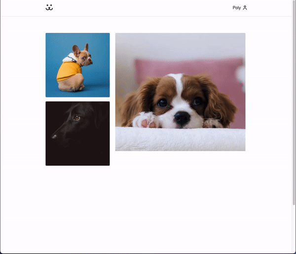

<div align="center">
   <h1>🐶 Dogs Media 🐾</h1>
</div>

<h3 align="center">  
  <p align="center">
    <a href="#-sobre">Sobre</a>&nbsp;&nbsp;&nbsp;|&nbsp;&nbsp;&nbsp;
    <a href="#-tecnologias">Tecnologias</a>&nbsp;&nbsp;&nbsp;|&nbsp;&nbsp;&nbsp;
    <a href="#-como-executar">Como Executar</a>&nbsp;&nbsp;&nbsp;|&nbsp;&nbsp;&nbsp;
    <a href="#-licença">Licença</a>
  </p>
</h3>



## 📚 Sobre

O projeto ***Dogs*** consiste em uma rede social para cães, onde é possível adicionar fotos, fazer comentários, curtir e visualizar outros feeds de usuários. 

Permite também a visualização de um gráfico para acompanhar o engajamento sobre cada feed postado na página social.

## 🚀 Tecnologias utilizadas:

- ReactJS
- CSS Modules
- Biblioteca Victory (usada para os gráficos e visualização de dados)

## ⏱ Como executar

```bash
# Clonar o repositório
$ git clone https://github.com/polyanetuag/dogs.git

# Entrar na pasta
$ cd dogs

# Instalar as dependências
$ yarn

# Iniciar o servidor
$ yarn start

# O servidor será inicializado em <http://localhost:3000>
```

## 📝 Licença

Esse projeto está sob a licença MIT.

---

Desenvolvido com 💜 por Polyane Tuag
